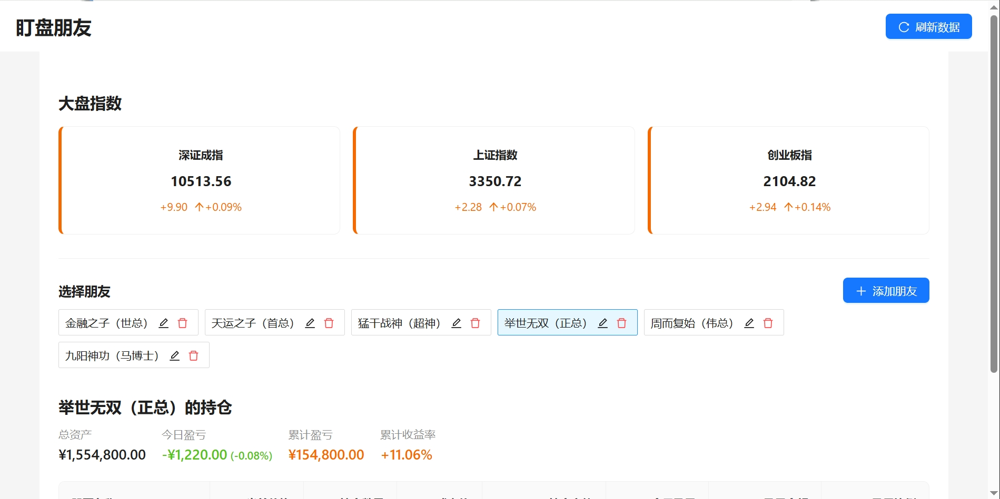
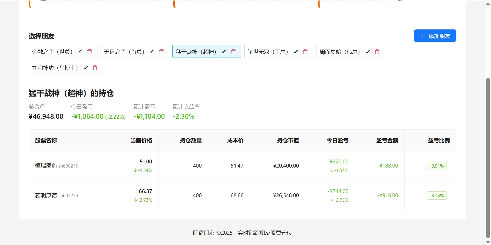

# 盯盘朋友仓位助手 - 股票仓位追踪应用

这是一个用于追踪朋友股票仓位和实时涨跌的 Web 应用。

## 开源信息

本项目是开源的，遵循 MIT 许可证，欢迎贡献和改进。

- **GitHub 仓库**: [https://github.com/123xiao/stock-tracker](https://github.com/123xiao/stock-tracker)
- **许可协议**: MIT
- **贡献方式**: 欢迎通过 Pull Request 提交改进和新功能

## 主要功能

- **大盘指数展示**：在页面上方实时显示主要市场指数（上证指数、深证成指、创业板指）
- **朋友仓位管理**：可以添加、编辑、删除多个朋友的股票仓位信息
- **实时股票数据**：展示股票的实时价格和涨跌情况
- **持仓盈亏计算**：自动计算每个持仓的盈亏金额和盈亏比例
- **今日盈亏统计**：展示每只股票的今日盈亏和朋友的今日总盈亏
- **数据本地存储**：所有朋友和持仓数据持久化保存在浏览器本地存储中
- **模拟仓功能**：提供虚拟账户进行模拟交易，可买入卖出股票，实时计算盈亏
- **交易记录追踪**：记录所有模拟交易的历史记录，帮助分析交易策略
- **跨平台支持**：支持打包为 Windows 桌面应用程序

## 在线体验

您可以直接访问以下地址体验应用：

[https://stock-tracker-3fu.pages.dev/](https://stock-tracker-3fu.pages.dev/)

## 系统截图

### 首页展示



### 添加朋友仓位


### 朋友持仓详情



## 技术栈

- React 19
- TypeScript
- Ant Design UI 组件库
- 本地存储 (localStorage)
- 雪球网股票 API - 实时股票数据
- Electron - 桌面应用打包

## 如何运行

### Web 应用

1. 安装依赖：

   ```
   npm install
   ```

2. 启动开发服务器：

   ```
   npm start
   ```

3. 在浏览器中访问：
   ```
   http://localhost:3000
   ```

### 桌面应用

1. 开发模式运行桌面应用：

   ```
   npm run electron-dev
   ```

2. 打包为 Windows 桌面应用：

   ```
   npm run electron-pack
   ```

3. 打包完成后，安装文件位于`dist`目录下。

## 使用说明

1. **查看大盘指数**：

   - 页面上方显示主要市场指数（上证指数、深证成指、创业板指）
   - 点击右上角的"刷新数据"按钮获取最新数据

2. **添加朋友及持仓**：

   - 点击"添加朋友"按钮打开添加表单
   - 输入朋友名称
   - 添加朋友的股票持仓信息（股票代码、名称、持仓数量、成本价）
   - 点击"添加"按钮保存信息
   - 添加成功后，朋友会显示在左侧列表中

3. **编辑朋友持仓**：

   - 点击朋友卡片上的"编辑"按钮打开编辑表单
   - 修改朋友名称或持仓信息
   - 可以添加或删除股票
   - 点击"保存"按钮更新信息

4. **删除朋友**：

   - 点击朋友卡片上的"删除"按钮
   - 确认删除操作
   - 系统将自动切换到其他朋友的仓位显示

5. **查看朋友持仓**：

   - 点击朋友卡片选择要查看的朋友
   - 下方表格将显示该朋友的持仓情况
   - 可以查看持仓总资产、今日盈亏、累计盈亏和累计收益率
   - 表格展示每只股票的详细信息，包括价格、持仓数量、成本价、今日盈亏及总盈亏

6. **今日盈亏查看**：

   - 朋友持仓概览中显示"今日盈亏"指标，包括金额和百分比
   - 表格中的"今日盈亏"列显示每只股票的今日盈亏金额和涨跌幅

7. **刷新数据**：

   - 点击页面右上角的"刷新数据"按钮可立即更新所有股票数据

8. **模拟仓管理**：

   - 点击导航栏上的"模拟仓"标签切换到模拟仓管理页面
   - 创建新的模拟仓：点击"创建模拟仓"按钮，输入名称和初始资金
   - 查看现有模拟仓列表，包括资金状况和预估市值
   - 点击"查看"进入模拟仓详情页
   - 点击删除按钮可以删除不需要的模拟仓

9. **模拟交易操作**：
   - 在模拟仓详情页可以查看当前持仓和交易记录
   - 买入股票：点击"买入股票"按钮，选择股票，输入数量和价格
   - 卖出股票：在持仓列表中点击"卖出"按钮，输入卖出数量和价格
   - 实时查看持仓盈亏和账户总盈亏

## 注意事项

- 本应用使用雪球网的股票数据 API
- 股票代码格式为：沪市股票以"SH"开头，深市股票以"SZ"开头，如：SH600000、SZ000001
- 所有朋友和持仓数据保存在浏览器的本地存储中，清除浏览器缓存会导致数据丢失
- 股票代码输入时不区分大小写，系统会自动转换为大写格式
- 桌面版应用需要联网才能获取实时股票数据
