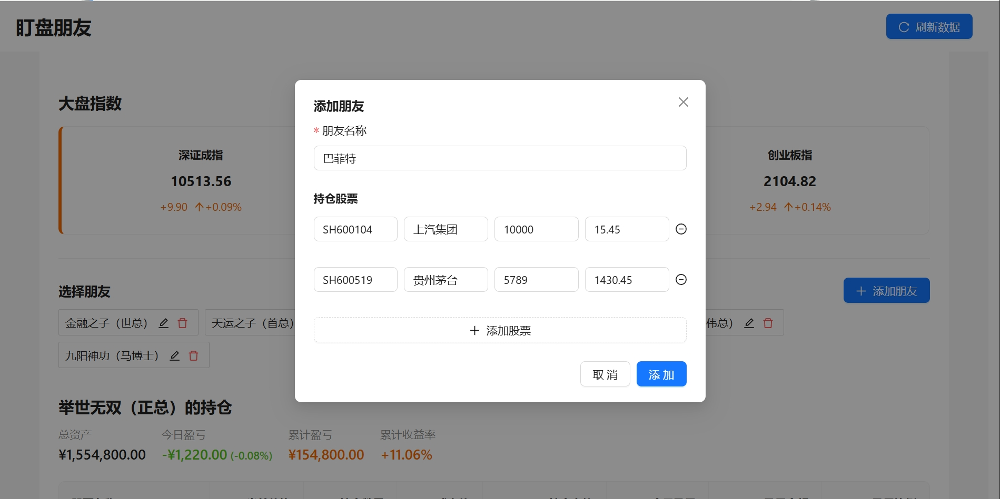

# 盯盘朋友 - 股票仓位追踪应用

这是一个用于追踪朋友股票仓位和实时涨跌的 Web 应用。

## 主要功能

- **大盘指数展示**：在页面上方实时显示主要市场指数（上证指数、深证成指、创业板指）
- **朋友仓位管理**：可以添加、编辑、删除多个朋友的股票仓位信息
- **实时股票数据**：展示股票的实时价格和涨跌情况
- **持仓盈亏计算**：自动计算每个持仓的盈亏金额和盈亏比例
- **今日盈亏统计**：展示每只股票的今日盈亏和朋友的今日总盈亏
- **数据本地存储**：所有朋友和持仓数据持久化保存在浏览器本地存储中

## 系统截图

### 首页展示


### 添加朋友仓位



### 朋友持仓详情


## 技术栈

- React 19
- TypeScript
- Ant Design UI 组件库
- 本地存储 (localStorage)
- 雪球网股票 API - 实时股票数据

## 如何运行

1. 安装依赖：

   ```
   npm install
   ```

2. 启动开发服务器：

   ```
   npm start
   ```

3. 在浏览器中访问：
   ```
   http://localhost:3000
   ```

## 使用说明

1. **查看大盘指数**：

   - 页面上方显示主要市场指数（上证指数、深证成指、创业板指）
   - 点击右上角的"刷新数据"按钮获取最新数据

2. **添加朋友及持仓**：

   - 点击"添加朋友"按钮打开添加表单
   - 输入朋友名称
   - 添加朋友的股票持仓信息（股票代码、名称、持仓数量、成本价）
   - 点击"添加"按钮保存信息
   - 添加成功后，朋友会显示在左侧列表中

3. **编辑朋友持仓**：

   - 点击朋友卡片上的"编辑"按钮打开编辑表单
   - 修改朋友名称或持仓信息
   - 可以添加或删除股票
   - 点击"保存"按钮更新信息

4. **删除朋友**：

   - 点击朋友卡片上的"删除"按钮
   - 确认删除操作
   - 系统将自动切换到其他朋友的仓位显示

5. **查看朋友持仓**：

   - 点击朋友卡片选择要查看的朋友
   - 下方表格将显示该朋友的持仓情况
   - 可以查看持仓总资产、今日盈亏、累计盈亏和累计收益率
   - 表格展示每只股票的详细信息，包括价格、持仓数量、成本价、今日盈亏及总盈亏

6. **今日盈亏查看**：

   - 朋友持仓概览中显示"今日盈亏"指标，包括金额和百分比
   - 表格中的"今日盈亏"列显示每只股票的今日盈亏金额和涨跌幅

7. **刷新数据**：
   - 点击页面右上角的"刷新数据"按钮可立即更新所有股票数据

## 注意事项

- 本应用使用雪球网的股票数据 API
- 股票代码格式为：沪市股票以"SH"开头，深市股票以"SZ"开头，如：SH600000、SZ000001
- 所有朋友和持仓数据保存在浏览器的本地存储中，清除浏览器缓存会导致数据丢失
- 股票代码输入时不区分大小写，系统会自动转换为大写格式
